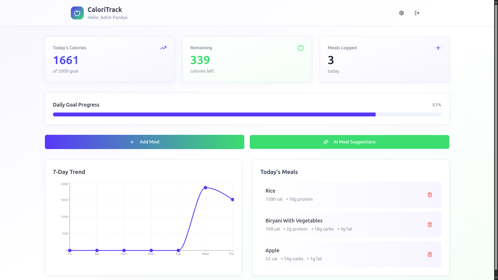

# 🍎 CaloriTrack - AI-Powered Calorie Tracking App

<div align="center">


[](https://your-app-url.lovable.app)
[](LICENSE)

**Track your calories effortlessly with AI-powered meal suggestions**

[Features](#-features) • [Tech Stack](#-tech-stack) • [Getting Started](#-getting-started) • [Screenshots](#-screenshots) • [API](#-nutrition-api)

</div>

---

## 📸 Screenshots

> **Note**: Add screenshots of your UI here. Recommended screenshots:
> - Landing page with gradient hero section
> - Dashboard showing stats cards and progress bar
> - 7-Day trend chart with data visualization
> - Add meal dialog with nutrition search
> - AI suggestions dialog
 Screenshot(s) of the app UI. If you'd like the image embedded in the repository, place the dashboard image at `assets/screenshot-dashboard.png`.

 <div align="center">

 

 <sub>Dashboard: daily calories, remaining budget, progress bar and 7-day trend chart.</sub>

 </div>

 If the image file is missing, you'll see a broken image icon on GitHub. Add the provided screenshot to `assets/screenshot-dashboard.png` and re-run the following to include it in the repo:

 ```bash
 git add assets/screenshot-dashboard.png
 git commit -m "chore(docs): add dashboard screenshot"
 git push origin main
 ```
---

## ✨ Features

### 🎯 Core Functionality
- **Calorie Tracking**: Log meals with detailed nutrition information (calories, protein, carbs, fat)
- **Daily Goal Management**: Set and track your daily calorie goals
- **Visual Analytics**: Beautiful 7-day trend chart to visualize your progress
- **Real-time Updates**: See your progress update instantly as you add meals

### 🤖 AI-Powered Features
- **Smart Meal Suggestions**: Get AI-generated meal recommendations based on:
  - Your remaining calorie budget
  - Your recent meal history
  - Nutritional balance
- **Powered by Gemini 2.5 Flash**: Fast, accurate, and contextual suggestions

### 🔐 User Management
- **Secure Authentication**: Email-based authentication with auto-confirm
- **Personal Profiles**: Each user has their own profile and meal history
- **Data Privacy**: Row-level security ensures your data stays private

### 🎨 Modern UI/UX
- **Responsive Design**: Works beautifully on desktop, tablet, and mobile
- **Dark Mode Ready**: Seamless dark/light theme support
- **Smooth Animations**: Polished transitions and interactions
- **Accessible**: Built with accessibility in mind

---

## 🛠 Tech Stack

### Frontend
- **React 18** - Modern React with hooks
- **TypeScript** - Type-safe development
- **Vite** - Lightning-fast build tool
- **Tailwind CSS** - Utility-first styling
- **shadcn/ui** - Beautiful, accessible components
- **Recharts** - Data visualization
- **React Router** - Client-side routing
- **React Query** - Server state management

### Backend (Lovable Cloud)
- **Supabase** - Backend as a Service
  - PostgreSQL database
  - Row Level Security (RLS)
  - Real-time subscriptions
  - Edge Functions (Serverless)
  - Authentication

### AI & APIs
- **Lovable AI Gateway** - Access to Gemini 2.5 Flash
- **USDA FoodData Central API** - Comprehensive nutrition database (100,000+ foods)

---

## 🚀 Getting Started

### Prerequisites
- Node.js 18+ and npm
- Git

### Installation

1. **Clone the repository**
   ```bash
   git clone <YOUR_GIT_URL>
   cd calorie-tracker-webapp
   ```

2. **Install dependencies**
   ```bash
   npm install
   ```

3. **Set up environment variables**
   
   The `.env` file is auto-configured with Lovable Cloud. It includes:
   - `VITE_SUPABASE_URL`
   - `VITE_SUPABASE_PUBLISHABLE_KEY`
   - `VITE_SUPABASE_PROJECT_ID`

4. **Start the development server**
   ```bash
   npm run dev
   ```

5. **Open your browser**
   
   Navigate to `http://localhost:5173`

### Database Setup

The database schema is automatically managed through Supabase migrations in `supabase/migrations/`. The schema includes:

- **profiles** table - User profiles with daily calorie goals
- **meals** table - Logged meals with nutrition data
- **RLS policies** - Secure data access per user
- **Triggers** - Automatic profile creation on signup

---

## 🍔 Nutrition API

### USDA FoodData Central

We use the **USDA FoodData Central API**, which provides:

- ✅ **Free to use** - No API key required for basic use (DEMO_KEY)
- ✅ **Comprehensive** - 100,000+ foods in the database
- ✅ **Reliable** - Official government database
- ✅ **Detailed** - Includes calories, protein, carbs, fats, and more

#### Why USDA over Nutritionix?

| Feature | USDA FoodData Central | Nutritionix |
|---------|----------------------|-------------|
| Cost | Free | Paid tiers required |
| API Key | Optional (DEMO_KEY works) | Required |
| Database Size | 100,000+ foods | Large database |
| Data Quality | Official government data | Community + verified |
| Rate Limits | Generous free tier | Limited on free tier |

#### Get Your Own API Key (Optional)

While the DEMO_KEY works for testing, you can get your own free API key:

1. Visit [FoodData Central](https://fdc.nal.usda.gov/api-guide.html)
2. Request an API key
3. Add it to your edge function (replace `DEMO_KEY` in `supabase/functions/search-nutrition/index.ts`)

#### Alternative APIs

If you want to use a different nutrition API, here are some options:

**1. Edamam Nutrition API**
- Pros: Very detailed, includes recipes, barcode scanning
- Cons: Requires API key, limited free tier (5,000 requests/month)
- Website: [Edamam](https://www.edamam.com/)

**2. Open Food Facts API**
- Pros: Completely free and open source, 2M+ products
- Cons: Primarily packaged foods, less produce data
- Website: [Open Food Facts](https://world.openfoodfacts.org/data)

**3. FatSecret Platform API**
- Pros: Good mobile SDKs, comprehensive database
- Cons: Requires API key and OAuth
- Website: [FatSecret](https://platform.fatsecret.com/api/)

**4. Spoonacular API**
- Pros: Includes recipes, meal planning, wine pairing
- Cons: Paid service, complex pricing
- Website: [Spoonacular](https://spoonacular.com/food-api)

To switch APIs, modify `supabase/functions/search-nutrition/index.ts` with the new API endpoint and data transformation logic.

---

## 📱 Usage

### Creating an Account
1. Click "Get Started Free" on the landing page
2. Fill in your email and password
3. Set your daily calorie goal

### Tracking Meals
1. Click "Add Meal" on the dashboard
2. Search for a food item (e.g., "chicken breast")
3. Adjust quantity if needed
4. Click "Add Meal"

### Getting AI Suggestions
1. Click "AI Meal Suggestions" on the dashboard
2. Review personalized recommendations
3. Add suggested meals directly to your log

### Viewing Progress
- Check the **7-Day Trend** chart for your weekly overview
- Monitor **Today's Calories** vs your daily goal
- See **Remaining** calories at a glance

---

## 🏗 Project Structure

```
calorie-tracker-webapp/
├── src/
│   ├── components/          # React components
│   │   ├── ui/             # shadcn/ui components
│   │   ├── AddMealDialog.tsx
│   │   ├── AISuggestionsDialog.tsx
│   │   ├── CalorieChart.tsx
│   │   └── MealList.tsx
│   ├── pages/              # Page components
│   │   ├── Auth.tsx        # Authentication page
│   │   ├── Dashboard.tsx   # Main dashboard
│   │   └── Index.tsx       # Landing page
│   ├── integrations/       # Supabase integration
│   │   └── supabase/
│   ├── App.tsx             # Main app component
│   └── main.tsx            # Entry point
├── supabase/
│   ├── functions/          # Edge functions
│   │   ├── ai-suggest-meals/
│   │   └── search-nutrition/
│   ├── migrations/         # Database migrations
│   └── config.toml         # Supabase configuration
├── java-backend/           # Optional Java 21 backend
└── public/                 # Static assets
```

---

## 🔧 Available Scripts

```bash
npm run dev          # Start development server
npm run build        # Build for production
npm run preview      # Preview production build
npm run lint         # Run ESLint
```

---

## 🌟 Key Components

### CalorieChart
Interactive line chart showing 7-day calorie trends with dummy data for demonstration.

### AddMealDialog
Smart dialog with nutrition search integration. Searches USDA database and displays results with serving sizes.

### AISuggestionsDialog
AI-powered meal recommendations using Gemini 2.5 Flash, considering remaining calories and recent meals.

### Dashboard
Main application interface with stats cards, progress tracking, and quick actions.

---

## 🔐 Security

- **Row Level Security (RLS)**: All database tables have RLS policies ensuring users can only access their own data
- **Authentication**: Secure email/password authentication with Supabase
- **Environment Variables**: Sensitive data stored in environment variables
- **API Keys**: Edge functions handle API keys server-side

---

## 🚢 Deployment

### Deploy to Vercel

```bash
# Install Vercel CLI
npm i -g vercel

# Deploy
vercel
```

### Deploy to Netlify

```bash
# Install Netlify CLI
npm i -g netlify-cli

# Build and deploy
npm run build
netlify deploy --prod --dir=dist
```

### Environment Variables for Production

Make sure to set these environment variables in your hosting platform:
- `VITE_SUPABASE_URL`
- `VITE_SUPABASE_PUBLISHABLE_KEY`
- `VITE_SUPABASE_PROJECT_ID`

---

## 🤝 Contributing

Contributions are welcome! Please feel free to submit a Pull Request.

1. Fork the project
2. Create your feature branch (`git checkout -b feature/AmazingFeature`)
3. Commit your changes (`git commit -m 'Add some AmazingFeature'`)
4. Push to the branch (`git push origin feature/AmazingFeature`)
5. Open a Pull Request

---

## 🐛 Known Issues & Roadmap

### Current Limitations
- USDA API uses DEMO_KEY (limited rate limits)
- Chart shows dummy data when no meals are logged

### Future Enhancements
- [ ] Barcode scanning for packaged foods
- [ ] Meal templates and favorites
- [ ] Weekly/monthly reports
- [ ] Export data to CSV
- [ ] Macro tracking goals
- [ ] Weight tracking integration
- [ ] Social features (share meals, challenges)
- [ ] Mobile app (React Native)

---

## 📄 License

This project is licensed under the MIT License - see the [LICENSE](LICENSE) file for details.

---

## 🙏 Acknowledgments

- **Lovable** - For the amazing development platform and AI gateway
- **Supabase** - For the powerful backend infrastructure
- **USDA** - For providing free, comprehensive nutrition data
- **shadcn/ui** - For beautiful, accessible components
- **Recharts** - For elegant data visualization

---

## 📞 Support

If you have any questions or run into issues:

- 🐛 Issues: [GitHub Issues](YOUR_REPO_URL/issues)
- 💬 Discussions: [GitHub Discussions](YOUR_REPO_URL/discussions)
- 📧 Email: your-email@example.com

---

## 📖 Additional Documentation

### Java Backend (Optional)

This repository includes an optional Spring Boot backend in `java-backend/` targeting Java 21 (LTS).

**Prerequisites**: JDK 21 installed and available to Maven

**Quick Install (Linux - Debian/Ubuntu)**:
```sh
sudo apt update
sudo apt install -y wget unzip
wget https://github.com/adoptium/temurin21-binaries/releases/latest/download/OpenJDK21U-jdk_x64_linux_hotspot_21_latest.tar.gz
sudo tar -xzf OpenJDK21U-jdk_x64_linux_hotspot_21_latest.tar.gz -C /usr/lib/jvm/
sudo update-alternatives --install /usr/bin/java java /usr/lib/jvm/jdk-21/bin/java 1
sudo update-alternatives --install /usr/bin/javac javac /usr/lib/jvm/jdk-21/bin/javac 1
```

**Build the backend**:
```sh
cd java-backend
mvn -DskipTests package
```

---

<div align="center">

**Built with ❤️ using [Lovable](https://lovable.dev)**

⭐ Star this repo if you find it helpful!

[⬆ Back to Top](#-caloritrack---ai-powered-calorie-tracking-app)

</div>
